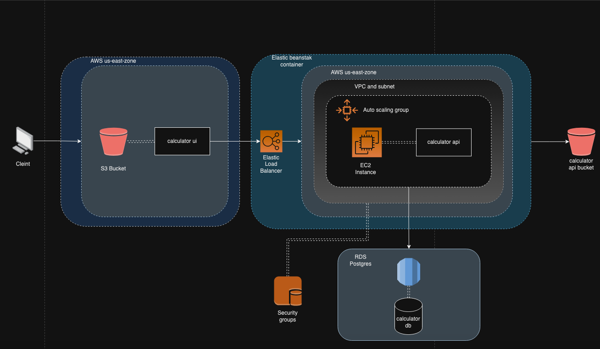
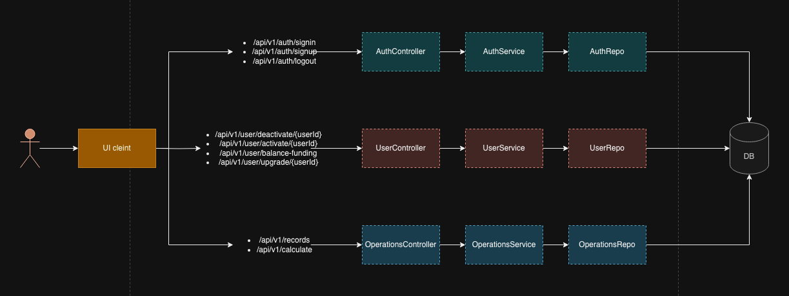
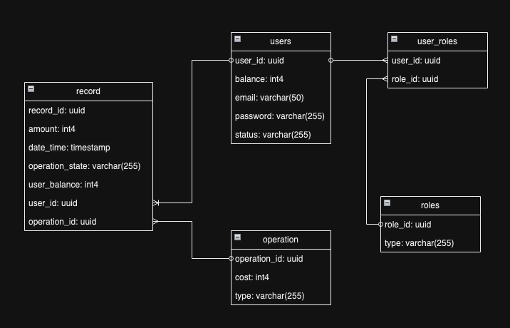

# Calculator App Overview

The app basically consists of typical layered architecture application with a standard ui application written in react and a backend application written in Java/Spring. The high level architecture of the application looks as the following:

As it can be seen the application is deployed now in AWS, where the calculator ui part is deployed in a S3 bucket that hosts static websites and has a public ip. On the other hand the calculator api is deployed in a elastic beanstalk container where the application is encapsulated in a EC2 instance that is tied to an autoscaling group. The static content of that calculator api is being stored in a S3 bucket. The database that is being used now is a PostgreSQL database hosted in AWS RDS. It is also important to mention that the application api is only a monolith that holds all the functionality from the authentication, the users management and the operations which is the core of the application. The ui currently is storing the authentication state using redux to preserve the sessions. Here is a summary of how the application works under the hood:

The database model can be seen in the following diagram:

It is also important to mention that the app is currently being deployed to the cloud using the github actions pipelines.

## Calculator ui - How to use it
*Live version:*
* The live site for this application can be found [here](http://calculator-app-ui.s3-website-us-east-1.amazonaws.com).
* There is already a user created; **_username_**: `admin@yopmail.com`, **_password_**: `password`

*Local Environment:*
* Make sure to have the [api](https://github.com/davidgalvis95/calculator-api) running locally.
* Clone the following repo https://github.com/davidgalvis95/calculator-ui.
* Run `npm install`.
* in the root folder of this repository create a file named `.env.local`.
* Insert the following line in that `.env.local` file: `REACT_APP_API_BASE_URL=http://localhost:8080`.
* run `npm run build` to build the ui.
* run `npm run start-local` to run the application.
* Use the same credentials provided in the live version to access the UI.

With these simple steps you are all set up for the UI.
